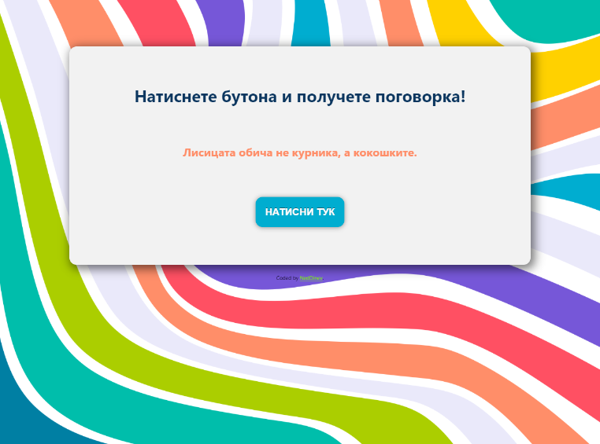
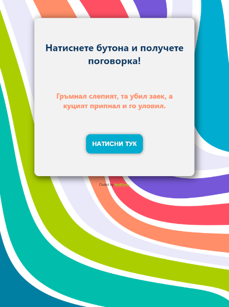
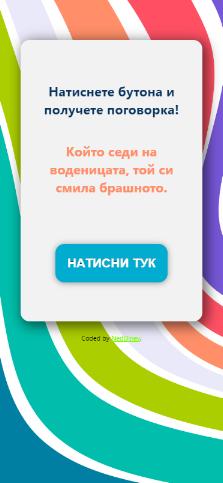

# Bulgarian-sayings-generator
## Table of contents

- [Overview](#overview)
  - [The project](#the-project)
  - [Screenshot](#screenshot)
  - [Links](#links)
  - [Built with](#built-with)
  - [Useful resources](#useful-resources)
- [Author](#author)

## Overview

### The project

Users should be able to:

- View the optimal layout of the design depending on their device's screen size
- Generate random bulgarian sayings

### Screenshot







### Links

- Live Site URL: [Link](https://bulgarian-sayings-generator.vercel.app/)

### Built with

- Semantic HTML5 markup
- SASS
- Javascript
- Media queries

<h1>Some Javascript code I'm proud of</h1>

```js
let quote = document.getElementById("quote");
let button = document.getElementById("button");
let quoteList = [...];
function getRandomInt() {
  quote.innerHTML = quoteList[Math.floor(Math.random() * quoteList.length)];
}
```
### Useful resources
- For icons - https://icons8.com/
- For backgrounds - https://products.ls.graphics/paaatterns/
- For sayings - https://bg.wikipedia.org/

## Author

- Github - [NedDinev](https://www.github.com/neddinev)
- Frontend Mentor - [@NedDinev](https://www.frontendmentor.io/profile/neddinev)
